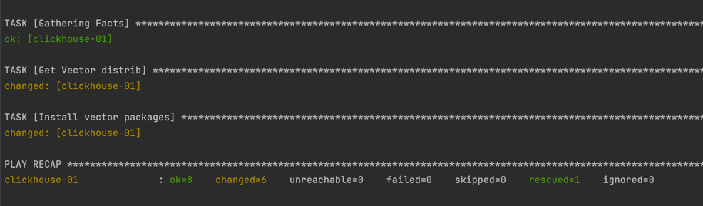

# Домашнее задание к занятию "8.2 «Работа с Playbook»"

## Project Install Clickhouse and Veсtor Ansible-Playbook

Данный Playbook устанавливает на удаленный хост yandex.cloud ПО Clickhouse and Veсtor

## Installation
Установка производится на ВМ yandex.cloud с предустановленной ОС Centos7

## Prerequisite
Ansible 2.10

## Install
```
ansible-playbook -i inventory/prod.yml site.yml
```
## Result



